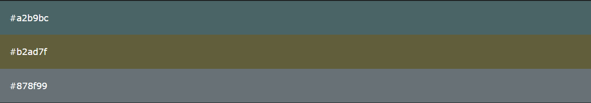

# Chapter 0 - Introduction to Sass

## What is Sass?

- **Sass** stands for **S**yntactically **A**wesome **S**tyle**s**heet
- Sass is a CSS preprocessor that lets you use styles in your CSS
- Sass reduces repetition of CSS and therefore saves time
- Sass was designed by Hampton Catlin and developed by Natalie Weizenbaum in 2006 and is free to download.

## Why to use Sass?

Stylesheets are getting larger, more complex, and harder to maintain. This is where a CSS pre-processor can help.

Sass lets you use features that do not exist in CSS, like variables, nested rules, mixins, imports, inheritance, built-in functions, and other stuff.

## What You Should Already Know?

Before you continue you should have a basic understanding of the following:

- HTML
- CSS

## A Simple Example why Sass is Useful

Let's say we have a website with three main colors:



So, how many times do you need to type those HEX values? A LOT of times. And what about variations of the same colors?

Instead of typing the above values a lot of times, you can use Sass and write this:

```scss
/* define variables for the primary colors */
$primary_1: #a2b9bc;
$primary_2: #b2ad7f;
$primary_3: #878f99;

/* use the variables */
.main-header {
  background-color: $primary_1;
}

.menu-left {
  background-color: $primary_2;
}

.menu-right {
  background-color: $primary_3;
}
```

So, when using Sass, and the primary color changes, you only need to change it in one place.

## How Does Sass Work?

A browser does not understand Sass code. Therefore, you will need a Sass pre-processor to convert Sass code into standard CSS.
This process is called transpiling. So, you need to give a transpiler (some kind of program) some Sass code and then get some CSS code back.

> **Note: <u>Transpiling</u> is a term for taking a source code written in one language and transform/translate it into another language.**

## Sass File type

Sass file has `*.scss` extension.

## Sass Comments

Sass supports standard CSS comments `/* comment */`, and in addition it supports inline comments `// comment`:

```scss
/* define primary colors */
$primary_1: #a2b9bc;
$primary_2: #b2ad7f;

/* use the variables */
.main-header {
  background-color: $primary_1; // here you can put an inline comment
}
```

## Sass Installation

You can use VsCode's extension named **Live Sass Compiler** which will automatically compile your Sass code into CSS code.

## Links

[](https://twitter.com/pranjalagupte)  
[](https://www.instagram.com/pranjalagupte/)

## Authors

 - [@PranjalGupte](https://github.com/Pranjal-Gupte/)
